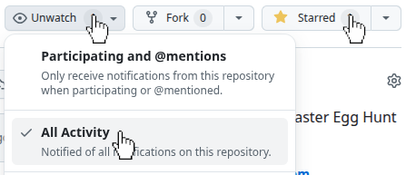

# 🐰🥚 Easter Egg Hunt @ Openapi

*Welcome to our Easter Egg Hunt!*

### 📅 How it works

* On **April 7th**, we will publish in this repository a list of **3 repositories** containing hidden *easter eggs*.
* Your goal is to explore them and discover as many easter eggs as possible until the **April 21th** included.

> **💡 Pro Tip**: Watch this repository to get notified when new discoveries are made and see if anyone has found more than you.
> 
> 

### 🔍 How to participate

1. Explore the listed repositories
   - https://github.com/openapi/openapi-cli
   - https://github.com/openapi/openapi-nodejs-sdk
   - https://github.com/openapi/openapi-php-sdk
3. Find the hidden Easter eggs
4. Go to this issue: [🐰🥚 Easter Egg Hunt 2026 — Submissions](https://github.com/openapi/openapi-easter-eggs/issues/1)
5. Leave a comment indicating **how many easter eggs you found**

### 👾 Showcase your skills

To celebrate the dedication of our most thorough contributors who submit their findings by **April 21th**:

* Digital Badge: You will be eligible to showcase an official badge on your GitHub profile.
* Special invitation: The contributor who demonstrates the highest level of technical precision and analytical skill will receive a complimentary ticket to attend We Make Future (WMF), Italy’s largest event on digital innovation, artificial intelligence, and technology, in recognition of their exceptional technical merit.

### 🚀 Ready to start?

🐰 Follow the rabbit ➜ 🥚 Find the eggs ➜ 🌟 Shine in the community

### 📜 Legal notes

**Please note:** *This initiative does not constitute a prize competition, as it is aimed at refining software projects and recognizing the personal merit of the participants.*
